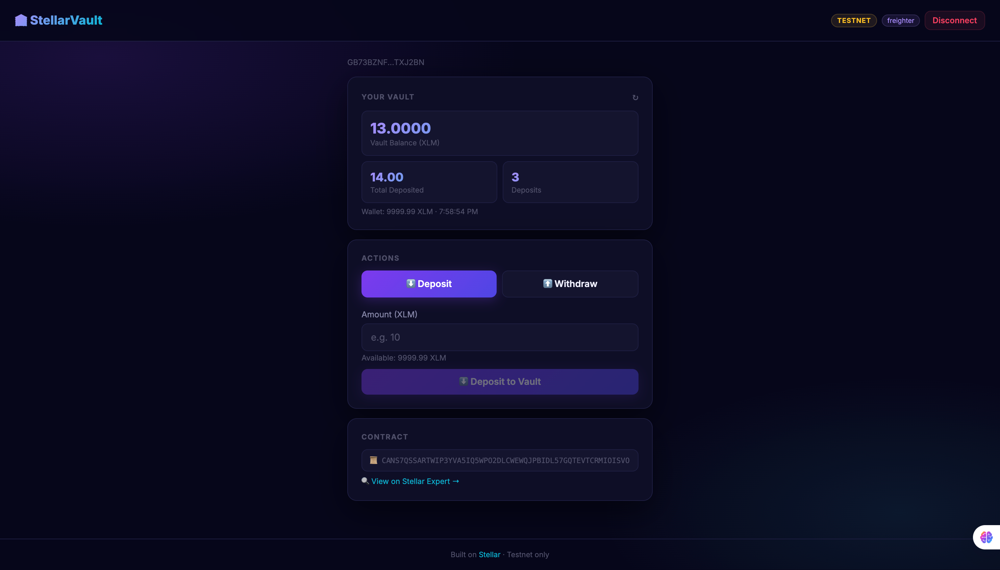

# 🏦 StellarVault

[](https://github.com/UncleTom29/StellarVault/actions/workflows/ci.yml)

StellarVault is a production-ready, non-custodial savings vault built on the **Stellar Network** using **Soroban smart contracts**. It allows users to securely deposit XLM into a personal vault via inter-contract calls to the native XLM Stellar Asset Contract (SAC), track their savings stats in real-time, and withdraw funds at any time.



## 🌐 Live Demo

**[https://stellar-vault-git-copilot-upgrade-stellar-vault-uncletom29s-projects.vercel.app](https://stellar-vault.vercel.app)**

## 📸 Mobile Responsive View


> The app is fully responsive across all screen sizes (380px – 1440px+). Key responsive breakpoints at 600px and 380px ensure optimal layout on all mobile devices.

## 🚀 CI/CD Pipeline

CI is powered by **GitHub Actions** and runs automatically on every push and pull request:

- ✅ **Frontend**: install → test (Vitest) → build (Vite)
- ✅ **Soroban Contract**: `cargo test` → `cargo build --target wasm32-unknown-unknown --release`

[](https://github.com/UncleTom29/StellarVault/actions/workflows/ci.yml)

## 🖥️ Desktop View


## 📺 Demo Video

[Watch Here](https://www.loom.com/share/545c28a298014af5ba1a86ca9f9a7629)

---

## ✨ Features
- **Non-Custodial**: Funds are held by the smart contract, not a central authority.
- **Inter-Contract Calls**: Vault contract calls the native XLM Stellar Asset Contract (SAC) for token transfers and balance checks.
- **Real-Time Streaming**: Live event streaming via Horizon SSE — vault updates instantly when transactions confirm.
- **Personalized Stats**: Dynamic tracking of total deposits, balance, and transaction count.
- **Smart Caching**: High-performance UI powered by a custom caching layer.
- **Multi-Wallet Support**: Seamless connection via `StellarWalletsKit` including Freighter and others.
- **Session Persistence**: Stay logged in even after page refreshes.
- **Mobile Responsive**: Fully optimized for all screen sizes.
- **CI/CD**: Automated testing and build pipeline via GitHub Actions.

---

## 📜 Contract Addresses

| Contract | Address | Explorer |
|---|---|---|
| **VaultContract** (Testnet) | `CANS7QSSARTWIP3YVA5IQ5WPO2DLCWEWQJPBIDL57GQTEVTCRMIOISVO` | [View](https://stellar.expert/explorer/testnet/contract/CANS7QSSARTWIP3YVA5IQ5WPO2DLCWEWQJPBIDL57GQTEVTCRMIOISVO) |
| **XLM Token SAC** (Testnet) | `CDLZFC3SYJYDZT7K67VZ75HPJVIEUVNIXF47ZG2FB2RMQQVU2HHGCYSC` | [View](https://stellar.expert/explorer/testnet/contract/CDLZFC3SYJYDZT7K67VZ75HPJVIEUVNIXF47ZG2FB2RMQQVU2HHGCYSC) |

### Sample Init Transaction
The contract was initialized with inter-contract call support referencing the XLM SAC.
Transaction hash for initialization: see [Stellar Expert](https://stellar.expert/explorer/testnet/contract/CANS7QSSARTWIP3YVA5IQ5WPO2DLCWEWQJPBIDL57GQTEVTCRMIOISVO)

---

## 🔗 Inter-Contract Calls

StellarVault uses **Soroban inter-contract calls** to interact with the native XLM Stellar Asset Contract (SEP-41 token interface):

- **`deposit`**: Calls `token::Client::transfer(user → vault, amount)` on the XLM SAC — actual on-chain token transfer.
- **`withdraw`**: Calls `token::Client::transfer(vault → user, amount)` on the XLM SAC.
- **`get_token_balance`**: Calls `token::Client::balance(address)` on the XLM SAC for real-time balance queries.

```rust
// Example inter-contract call in the vault contract
let token_client = token::Client::new(&env, &token_id);
token_client.transfer(&user, &env.current_contract_address(), &amount);
```

---

## 🛠️ Technology Stack

### Smart Contract
- **Language**: Rust
- **Platform**: Soroban (Stellar Smart Contracts)
- **SDK**: `soroban-sdk` v21.0.0
- **Build System**: Cargo + Wasm32
- **Inter-contract**: Native XLM SAC (SEP-41)

### Frontend
- **Framework**: React (Vite)
- **Styling**: Vanilla CSS (Mobile-first responsive design)
- **State Management**: Custom React Hooks (`useVault`, `useWallet`, `useEventStream`)
- **Stellar SDK**: `@stellar/stellar-sdk` v14.5.0
- **Wallet Integration**: `@creit.tech/stellar-wallets-kit`
- **Real-time**: Horizon SSE event streaming

### CI/CD
- **Platform**: GitHub Actions
- **Jobs**: Frontend tests + build; Soroban contract tests + WASM build

---

## 🚀 Getting Started

### Prerequisites
- Node.js v18+
- Rust & Cargo
- [Stellar CLI](https://developers.stellar.org/docs/build/smart-contracts/getting-started/setup#install-the-stellar-cli)

### Installation
1. Clone the repository:
   ```bash
   git clone https://github.com/UncleTom29/StellarVault.git
   cd StellarVault
   ```
2. Install dependencies:
   ```bash
   npm install
   ```

### Local Development
1. **Initialize Admin Account**:
   ```bash
   stellar keys generate admin --network testnet
   stellar keys fund admin --network testnet
   ```
2. **Deploy the Contract**:
   ```bash
   ADMIN_SECRET=$(stellar keys show admin) bash scripts/deploy.sh
   ```
3. **Configure Environment**:
   Copy the `CONTRACT_ID` output from the deployment script into your `.env`:
   ```env
   VITE_CONTRACT_ID=YOUR_CONTRACT_ID
   VITE_RPC_URL=https://soroban-testnet.stellar.org
   VITE_HORIZON_URL=https://horizon-testnet.stellar.org
   VITE_XLM_TOKEN_ID=CDLZFC3SYJYDZT7K67VZ75HPJVIEUVNIXF47ZG2FB2RMQQVU2HHGCYSC
   ```
4. **Run the App**:
   ```bash
   npm run dev
   ```

---

## 🧪 Testing

### Smart Contract Tests
```bash
cd contract
cargo test
```
Tests cover:
- Contract initialization with XLM token reference.
- Deposit with inter-contract token transfer.
- Withdrawal with inter-contract token transfer.
- Statistics tracking accuracy.
- Inter-contract balance query via `get_token_balance`.

### Frontend Tests
```bash
npm test
```
**Test Coverage (14+ Tests):**
- **Cache Engine (`cache.test.js`)**: TTL expiration, prefix deletion, and data retrieval.
- **Error Handling (`errors.test.js`)**: Parsing RPC errors, wallet rejections, and network failures.
- **Vault Hook (`vault.test.js`)**: State management, wallet disconnection handling, and initial data loading.

---

## 🛠️ Build & Deployment
To build for production:
```bash
npm run build
```
Deploy the `dist` folder to Vercel, Netlify, or similar.

---

## 🤝 Contributing
Contributions are welcome! Please feel free to submit a Pull Request.

## 📄 License
MIT © UncleTom29
